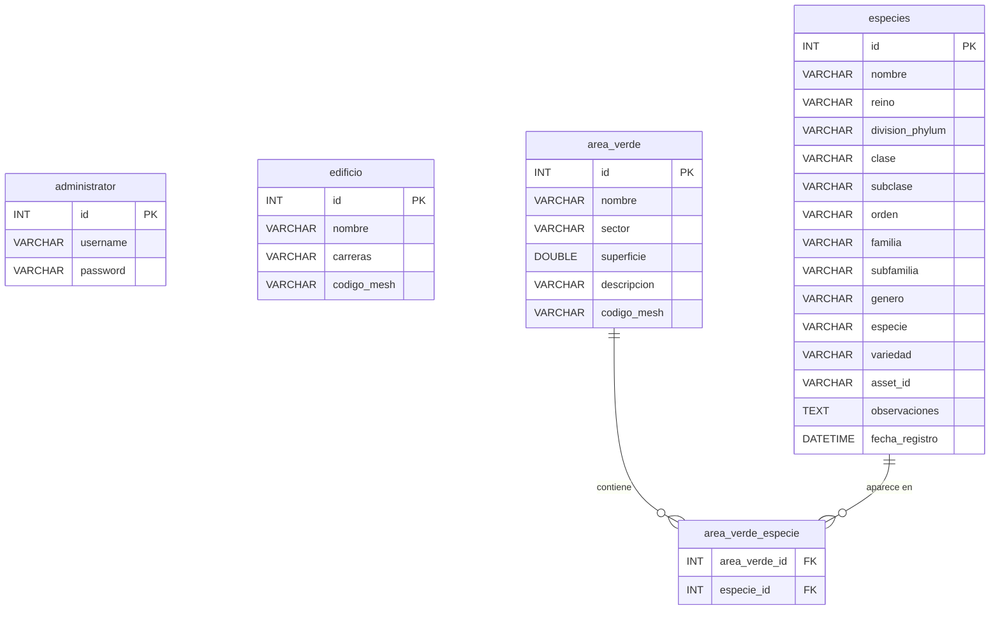
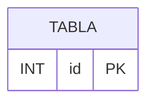

# Design Document

## Overview

Este documento define la arquitectura y el diseño de MANUAL_TECNICO.md, un manual técnico integral en español para el proyecto MAPAUTT. El entregable es un archivo Markdown único que documenta exhaustivamente la arquitectura del sistema, configuración, código fuente, base de datos, frontend 3D, API REST, autenticación, gestión de archivos, despliegue, mantenimiento y limitaciones conocidas.

El manual está dirigido a dos audiencias: desarrolladores que necesitan comprender y extender el sistema, y administradores de sistemas que necesitan instalar, configurar y mantener la aplicación en producción.

## Architecture

### Estructura del Documento

El MANUAL_TECNICO.md se organiza como un documento Markdown con jerarquía de encabezados estricta:

- `#` — Título principal del documento (uno solo)
- `##` — Secciones principales (exactamente 12)
- `###` — Subsecciones dentro de cada sección
- `####` — Sub-subsecciones (usadas en tablas de columnas, ejemplos de código, etc.)

### Orden de Secciones

```
1.  ## Descripción general del sistema
2.  ## Requisitos del entorno de desarrollo
3.  ## Instalación y configuración
4.  ## Arquitectura del código
5.  ## Base de datos
6.  ## Frontend y modelo 3D
7.  ## API REST
8.  ## Autenticación y seguridad
9.  ## Gestión de archivos (imágenes)
10. ## Despliegue
11. ## Mantenimiento y extensión
12. ## Problemas conocidos y limitaciones
```

### Diagrama de Componentes del Sistema

El manual incluirá un diagrama Mermaid de componentes que represente la arquitectura MVC:

```mermaid
graph TD
    subgraph "Cliente (Navegador)"
        TH[Thymeleaf Templates]
        JS[Three.js / JavaScript]
    end

    subgraph "Spring Boot Application"
        subgraph "controller"
            LC[LoginController]
            WC[WelcomeController]
            APC[AdminPanelController]
            MRC[MapRestController]
            MS[MapService]
        end
        subgraph "model"
            E[Edificio]
            AV[AreaVerde]
            ES[Especie]
            AD[Administrator]
            ER[EdificioRepository]
            AVR[AreaVerdeRepository]
            ESR[EspecieRepository]
            ADR[AdministratorRepository]
        end
        subgraph "app"
            M[Main]
            DS[DatabaseSeeder]
        end
    end

    subgraph "Datos"
        DB[(MariaDB - mapavutt)]
        FS[/static/images/custom/]
        GLB[/static/modelo/Mapa_UTTECAM.glb]
    end

    TH --> LC
    TH --> WC
    TH --> APC
    JS --> MRC
    MRC --> MS
    APC --> MS
    MS --> ER
    MS --> AVR
    MS --> ESR
    LC --> ADR
    ER --> DB
    AVR --> DB
    ESR --> DB
    ADR --> DB
    APC --> FS
    JS --> GLB
```

### Diagrama ER Mermaid

El manual incluirá un diagrama Entidad-Relación con la siguiente especificación:



## Components

### Sección 1: Descripción General del Sistema

**Contenido:**
- Propósito del sistema: mapa interactivo 3D de la Universidad Tecnológica de Tecamachalco
- Alcance funcional: visualización 3D, panel de administración CRUD, gestión de especies botánicas
- Stack tecnológico completo con versiones:
  - Backend: Spring Boot 4.1.0, Java 25, Maven wrapper
  - Base de datos: MariaDB (esquema `mapavutt`)
  - Frontend: Thymeleaf (server-side rendering), Three.js r128 (3D)
  - Modelo 3D: formato GLTF/GLB

### Sección 2: Requisitos del Entorno de Desarrollo

**Contenido:**
- JDK 25 (obligatorio)
- Maven wrapper incluido (`./mvnw` en Linux/macOS, `mvnw.cmd` en Windows)
- MariaDB 10.5+ o compatible
- Compatibilidad de SO: Linux, macOS, Windows (el wrapper Maven abstrae diferencias)
- IDE recomendado: IntelliJ IDEA o VS Code con Extension Pack for Java
- Navegador moderno con soporte WebGL para visualizar el modelo 3D

### Sección 3: Instalación y Configuración

**Contenido:**
- Pasos numerados: clonar repositorio, crear BD, configurar `application.properties`, ejecutar
- Bloque de código con `application.properties` completo documentado por parámetro:
  - `spring.datasource.url` — conexión JDBC a MariaDB
  - `spring.datasource.username` / `password` — credenciales
  - `spring.jpa.hibernate.ddl-auto=update` — gestión automática de esquema
  - `spring.servlet.multipart.max-file-size=10MB` — límite de subida
  - `spring.thymeleaf.prefix` — ruta de templates en desarrollo
- Comando de creación de BD: `CREATE DATABASE mapavutt;`
- Comando de ejecución: `./mvnw spring-boot:run`

### Sección 4: Arquitectura del Código

**Contenido:**
- Paquete `app`: `Main.java` (punto de entrada `@SpringBootApplication`), `DatabaseSeeder.java` (datos iniciales)
- Paquete `controller`:
  - `LoginController` — autenticación con HttpSession
  - `WelcomeController` — página de bienvenida
  - `AdminPanelController` — CRUD de edificios, áreas verdes y especies con subida de imágenes
  - `MapRestController` — endpoints REST JSON para el frontend 3D
  - `MapService` — lógica de negocio centralizada (acceso a repositorios)
- Paquete `model`:
  - Entidades JPA: `Edificio`, `AreaVerde`, `Especie`, `Administrator`
  - Repositorios Spring Data: `EdificioRepository`, `AreaVerdeRepository`, `EspecieRepository`, `AdministratorRepository`
- Descripción del patrón MVC: Controller recibe peticiones → Service gestiona lógica → Repository accede a BD → Model define entidades

### Sección 5: Base de Datos

**Contenido:**
- Esquema: `mapavutt` en MariaDB
- 5 tablas documentadas con columnas, tipos y restricciones
- Diagrama ER Mermaid (especificado arriba)
- Explicación de la relación Many-to-Many entre `area_verde` y `especies` a través de `area_verde_especie`
- Script DDL nativo (`schema.sql`) ejecutado al inicio con `spring.sql.init.mode=always`

### Sección 6: Frontend y Modelo 3D

**Contenido:**
- Estructura de templates Thymeleaf:
  - `mapa.html` — vista principal del mapa 3D
  - `admin_panel.html` — panel de administración
  - `login.html` — formulario de acceso
  - `welcome.html` — página de bienvenida
  - Fragments: `sidebar.html`, `sections.html`, `modal.html`
- Three.js r128:
  - `OrbitControls` — controles de cámara orbital
  - `GLTFLoader` — carga del modelo 3D
  - `EffectComposer` + `OutlinePass` — post-procesado para resaltar selección
- Archivos JavaScript:
  - `mapa.js` — lógica principal del visor 3D
  - `ubicacion.js` — sistema de geolocalización
  - `ubicacion-config.js` — configuración GPS y conversión de coordenadas
  - `mascota.js` — funcionalidad de mascota interactiva
- Modelo 3D: `/static/modelo/Mapa_UTTECAM.glb`
- Sistema de coordenadas GPS:
  - Origen: Entrada 1 (lat: 18.865175, lon: -97.723098)
  - Origen 3D correspondiente: X = -25, Z = 70
  - Conversión X: metrosEste = -596.72, metrosNorte = -27051.84
  - Conversión Z: metrosEste = -31933.56, metrosNorte = -6490.73

### Sección 7: API REST

**Contenido por endpoint:**

| Endpoint | Método | Descripción |
|----------|--------|-------------|
| `/api/map-data` | GET | Datos completos del mapa (edificios + áreas verdes) |
| `/api/edificios/{codigoMesh}` | GET | Datos de un edificio por código de mesh |
| `/api/areas-verdes/{identifier}` | GET | Datos de un área verde por ID numérico o código mesh |

Para cada endpoint se documenta:
- Propósito
- Parámetros de ruta
- Formato de respuesta JSON (ejemplo con estructura)
- Códigos HTTP (200 OK, 404 Not Found)

### Sección 8: Autenticación y Seguridad

**Contenido:**
- Mecanismo: `HttpSession` nativa de Servlet (sin Spring Security)
- Flujo de login:
  1. GET `/acceso` → muestra formulario
  2. POST `/acceso` con `username` + `password` → valida contra BD
  3. Si válido: `session.setAttribute("user", username)` → redirect a `/admin-panel`
  4. Si inválido: redirect a `/acceso?error=true`
- Logout: GET `/logout` → `session.invalidate()` → redirect
- Protección del panel: verificación `session.getAttribute("user") != null` en `AdminPanelController`
- Limitación: contraseñas en texto plano (sin hash)

### Sección 9: Gestión de Archivos (Imágenes)

**Contenido:**
- Convención de nombres: `{timestamp}_{UUID-8chars}.{ext}` (ejemplo: `1717000000000_a1b2c3d4.jpg`)
- Ubicación de almacenamiento: `src/main/resources/static/images/custom/`
- Duplicación en target: `target/classes/static/images/custom/` (si existe)
- Límite de tamaño: 10MB (`spring.servlet.multipart.max-file-size`)
- Validación: solo archivos con `contentType` que comience con `image/`
- Eliminación: se borran ambas copias (src y target) al eliminar o reemplazar

### Sección 10: Despliegue

**Contenido:**
- Build: `./mvnw clean package -DskipTests`
- Artefacto: `target/mapavutt-0.0.1-SNAPSHOT.jar`
- Ejecución: `java -jar target/mapavutt-0.0.1-SNAPSHOT.jar`
- Configuración de producción:
  - Cambiar `spring.thymeleaf.prefix` para usar classpath en lugar de filesystem
  - Configurar credenciales de BD seguras
  - Configurar acceso externo (puerto, host)
- Consideraciones: proxy reverso (nginx), servicio systemd, respaldos de BD

### Sección 11: Mantenimiento y Extensión

**Contenido:**
- Agregar nueva entidad: crear clase `@Entity`, crear interfaz `Repository extends JpaRepository`, agregar métodos al `MapService`, crear endpoints en controller
- Agregar nuevo mesh 3D: incluir mesh en modelo GLB, registrar `codigoMesh` en tabla `edificio` o `area_verde`, asegurar correspondencia de nombres
- Extender API REST: agregar método en `MapRestController` con `@GetMapping`/`@PostMapping`, inyectar servicio, retornar `ResponseEntity`

### Sección 12: Problemas Conocidos y Limitaciones

**Contenido (solo listado, sin mitigaciones):**
- Contraseñas almacenadas en texto plano
- Sin Spring Security (no hay filtros de seguridad, CSRF, etc.)
- Imágenes almacenadas en el filesystem del proyecto (no CDN/object storage)
- `spring.thymeleaf.prefix=file:...` vincula templates al filesystem en desarrollo
- No hay validación de entrada robusta en endpoints REST
- No hay paginación en consultas de listado
- El modelo 3D GLB no se regenera automáticamente si se agregan edificios

## Interfaces

### Convenciones de Código en el Manual

El manual utiliza bloques de código Markdown con etiqueta de lenguaje para todos los ejemplos:

```java
// Ejemplo de clase Entity
@Entity
@Table(name = "edificio")
public class Edificio {
    @Id
    @GeneratedValue(strategy = GenerationType.IDENTITY)
    private Integer id;
    // ...
}
```

```properties
# Ejemplo de configuración
spring.datasource.url=jdbc:mariadb://localhost:3306/mapavutt
```

```bash
# Ejemplo de comando
./mvnw spring-boot:run
```

```sql
-- Ejemplo de SQL
CREATE DATABASE mapavutt;
```



### Convenciones de Escritura

- **Idioma**: español técnico, sin anglicismos innecesarios (se mantienen nombres técnicos como "endpoint", "repository", "mesh")
- **Tono**: formal, directo, orientado a instrucciones
- **Formato de instrucciones**: listas numeradas para pasos secuenciales
- **Formato de referencia**: tablas para columnas de BD y endpoints
- **Rutas de archivo**: siempre entre backticks (`` ` ``)
- **Nombres de clase/método**: siempre entre backticks
- **Notas importantes**: prefijo con **Nota:** en negrita

## Data Models

### Estructura de Datos del Documento

El documento no tiene un modelo de datos propio ya que es un archivo Markdown estático. El contenido que documenta se refiere a los siguientes modelos de la aplicación:

| Modelo | Tabla BD | Campos Clave |
|--------|----------|--------------|
| `Edificio` | `edificio` | id, nombre, carreras, codigoMesh |
| `AreaVerde` | `area_verde` | id, nombre, sector, superficie, descripcion, codigoMesh |
| `Especie` | `especies` | id, nombre, reino, divisionPhylum, clase, subclase, orden, familia, subfamilia, genero, especie, variedad, assetId, observaciones, fechaRegistro |
| `Administrator` | `administrator` | id, username, password |

### Relación Many-to-Many

```
area_verde ←→ area_verde_especie ←→ especies
```

- `area_verde_especie` es tabla de unión con PK compuesta (`area_verde_id`, `especie_id`)
- FK con `ON DELETE CASCADE` en ambas direcciones
- En JPA: `@ManyToMany(fetch = FetchType.EAGER)` en `AreaVerde.especies`

## Error Handling

### Manejo de Contenido Ausente

Al generar el manual, si algún componente del código fuente no se encuentra (por ejemplo, si un archivo fue eliminado), la sección correspondiente indicará que el componente no fue encontrado pero mantendrá la estructura de 12 secciones intacta.

### Formato de Diagramas Mermaid

Si un diagrama Mermaid no puede renderizarse (por ejemplo, en un visor que no soporte Mermaid), el bloque de código fuente permanece visible como texto para referencia. Los diagramas incluyen comentarios `%%` para claridad.

### Validación Estructural

El documento debe cumplir:
- Exactamente un encabezado `#` (título)
- Exactamente 12 encabezados `##` (secciones principales)
- Sin saltos de nivel de encabezado (no pasar de `##` a `####` sin `###`)
- Todos los bloques de código con etiqueta de lenguaje

## Correctness Properties

*Una propiedad es una característica o comportamiento que debe mantenerse verdadero a lo largo de todas las ejecuciones válidas de un sistema — esencialmente, una declaración formal sobre lo que el sistema debe hacer. Las propiedades sirven como puente entre especificaciones legibles por humanos y garantías de corrección verificables por máquina.*

### Property 1: Jerarquía de encabezados consistente

*Para cualquier* encabezado en el documento MANUAL_TECNICO.md, su nivel (##, ###, ####) nunca debe saltar más de un nivel respecto al encabezado anterior. Es decir, un `####` solo puede aparecer después de un `###`, y un `###` solo después de un `##`.

**Validates: Requirements 1.4**

### Property 2: Completitud de documentación de clases

*Para cualquier* clase Java del proyecto (controllers, services, modelos, repositorios), dicha clase debe aparecer nombrada y descrita en la sección "Arquitectura del código" del manual.

**Validates: Requirements 5.1, 5.2**

### Property 3: Completitud del diagrama ER

*Para cualquier* tabla definida en `schema.sql`, esa tabla debe aparecer como entidad en el bloque Mermaid `erDiagram` del manual, y *para cualquier* columna de esa tabla, dicha columna debe estar listada dentro de la entidad correspondiente en el diagrama.

**Validates: Requirements 6.2, 6.4**

### Property 4: Completitud de documentación de endpoints REST

*Para cualquier* endpoint REST definido en `MapRestController.java`, el manual debe documentar su método HTTP, ruta, propósito, parámetros y estructura de respuesta JSON en la sección "API REST".

**Validates: Requirements 8.1, 8.2, 8.3, 8.4**
