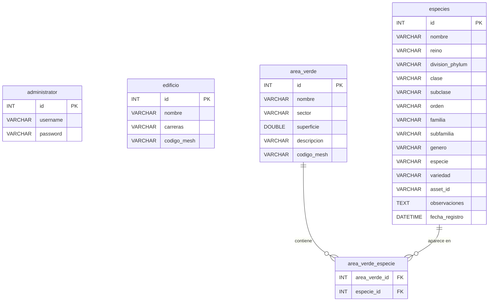

# Manual Técnico MAPAUTT

## Descripción general del sistema

### Propósito

MAPAUTT es un sistema de mapa interactivo 3D desarrollado para la Universidad Tecnológica de Tecamachalco (UTTECAM). Su objetivo principal es ofrecer una representación tridimensional navegable del campus universitario, permitiendo a los usuarios explorar edificios, áreas verdes y especies botánicas de manera visual e intuitiva desde un navegador web.

### Alcance funcional

El sistema cubre las siguientes funcionalidades:

1. **Visualización 3D del campus** — Modelo tridimensional del mapa universitario cargado en formato GLTF/GLB, con controles de cámara orbital, selección de objetos con resaltado visual y geolocalización del usuario.
2. **Panel de administración CRUD** — Interfaz web protegida por autenticación que permite crear, leer, actualizar y eliminar registros de edificios, áreas verdes y especies botánicas.
3. **Gestión de especies botánicas** — Catálogo taxonómico completo de especies vegetales asociadas a las áreas verdes del campus, con clasificación por reino, división, clase, orden, familia, género y especie.

### Stack tecnológico

| Componente | Tecnología | Versión |
|------------|-----------|---------|
| Lenguaje backend | Java | 25 |
| Framework backend | Spring Boot | 4.1.0 |
| Herramienta de build | Maven (wrapper incluido) | — |
| Base de datos | MariaDB | 10.5+ |
| Motor de templates | Thymeleaf | (gestionado por Spring Boot) |
| Biblioteca 3D | Three.js | r128 |
| Formato del modelo 3D | GLTF/GLB | — |
| ORM | Hibernate (Spring Data JPA) | (gestionado por Spring Boot) |

## Requisitos del entorno de desarrollo

### JDK

Se requiere **JDK 25** de forma obligatoria. El proyecto utiliza características del lenguaje Java 25 y no es compatible con versiones anteriores. Se recomienda utilizar una distribución como Eclipse Temurin, Oracle JDK o Amazon Corretto.

### Herramienta de build

El proyecto incluye el Maven Wrapper, por lo que no es necesario instalar Maven de forma global:

- **Linux / macOS**: ejecutar con `./mvnw`
- **Windows**: ejecutar con `mvnw.cmd`

El wrapper descarga automáticamente la versión correcta de Maven en la primera ejecución.

### Base de datos

Se requiere **MariaDB 10.5** o superior. También es compatible con versiones posteriores de MariaDB. El esquema de la base de datos se denomina `mapavutt` y se gestiona automáticamente mediante Hibernate (`spring.jpa.hibernate.ddl-auto=update`) y un script DDL inicial (`schema.sql`).

### Compatibilidad de sistema operativo

El proyecto es compatible con los siguientes sistemas operativos:

- **Linux** — cualquier distribución con JDK 25 disponible
- **macOS** — versiones con soporte para JDK 25
- **Windows** — Windows 10 o superior

El Maven Wrapper abstrae las diferencias entre plataformas. Los comandos de ejecución difieren únicamente en el nombre del script (`./mvnw` vs `mvnw.cmd`).

### IDE recomendado

Se recomienda utilizar uno de los siguientes entornos de desarrollo:

- **IntelliJ IDEA** (Community o Ultimate) — soporte nativo para proyectos Maven y Spring Boot.
- **Visual Studio Code** — con el Extension Pack for Java (incluye soporte para Maven, Spring Boot y depuración).

### Navegador web

Para visualizar el modelo 3D del campus es necesario un navegador moderno con soporte para **WebGL**. Navegadores compatibles:

- Google Chrome (versión 90+)
- Mozilla Firefox (versión 88+)
- Microsoft Edge (versión 90+)
- Safari (versión 15+)

**Nota:** Sin soporte WebGL habilitado, el visor 3D no se renderizará correctamente.

## Instalación y configuración

### Pasos de instalación

1. **Clonar el repositorio** del proyecto desde el sistema de control de versiones:

```bash
git clone <URL_DEL_REPOSITORIO> MAPAUTT
cd MAPAUTT
```

2. **Crear la base de datos** en MariaDB. Acceder al cliente de MariaDB y ejecutar:

```sql
CREATE DATABASE mapavutt;
```

3. **Configurar los parámetros de conexión** en el archivo `src/main/resources/application.properties`. Ajustar las credenciales de la base de datos según el entorno local (ver sección siguiente para detalle de cada parámetro).

4. **Ejecutar la aplicación** utilizando el Maven Wrapper:

```bash
./mvnw spring-boot:run
```

En Windows, utilizar:

```bash
mvnw.cmd spring-boot:run
```

La aplicación estará disponible en `http://localhost:8080` una vez iniciada correctamente.

### Configuración de `application.properties`

El archivo `src/main/resources/application.properties` contiene todos los parámetros de configuración del sistema. A continuación se documenta cada uno:

```properties
# Nombre de la aplicación (identificador interno de Spring Boot)
spring.application.name=mapavutt

# Prefijo de templates Thymeleaf — en desarrollo apunta al filesystem para
# permitir recarga en caliente sin recompilar
spring.thymeleaf.prefix=file:src/main/resources/templates/

# URL de conexión JDBC a la base de datos MariaDB
# Formato: jdbc:mariadb://<host>:<puerto>/<esquema>
spring.datasource.url=jdbc:mariadb://localhost:3306/mapavutt

# Usuario de la base de datos
spring.datasource.username=root

# Contraseña de la base de datos (vacía por defecto en desarrollo)
spring.datasource.password=

# Estrategia de gestión del esquema DDL por Hibernate:
# "update" crea o modifica tablas automáticamente sin eliminar datos existentes
spring.jpa.hibernate.ddl-auto=update

# Mostrar las consultas SQL generadas por Hibernate en la consola (útil para depuración)
spring.jpa.show-sql=true

# Formatear las consultas SQL en la salida de consola para mejor legibilidad
spring.jpa.properties.hibernate.format_sql=true

# Modo de inicialización SQL — "always" ejecuta schema.sql en cada arranque
# para asegurar que las tablas de unión y restricciones existan
spring.sql.init.mode=always

# Tamaño máximo permitido para archivos subidos (imágenes de especies)
spring.servlet.multipart.max-file-size=10MB

# Tamaño máximo total de la petición multipart
spring.servlet.multipart.max-request-size=10MB
```

### Parámetros clave

| Parámetro | Valor por defecto | Descripción |
|-----------|-------------------|-------------|
| `spring.datasource.url` | `jdbc:mariadb://localhost:3306/mapavutt` | Conexión JDBC al esquema `mapavutt` en MariaDB |
| `spring.datasource.username` | `root` | Usuario de la base de datos |
| `spring.datasource.password` | *(vacío)* | Contraseña de la base de datos |
| `spring.jpa.hibernate.ddl-auto` | `update` | Hibernate actualiza el esquema sin eliminar datos |
| `spring.servlet.multipart.max-file-size` | `10MB` | Límite de tamaño por archivo subido |
| `spring.thymeleaf.prefix` | `file:src/main/resources/templates/` | Ruta de templates en modo desarrollo |

**Nota:** En un entorno de producción, se deben ajustar las credenciales de la base de datos y cambiar `spring.thymeleaf.prefix` a `classpath:/templates/` para utilizar los templates empaquetados en el JAR.

## Arquitectura del código

### Estructura de paquetes

El código fuente del proyecto se organiza en tres paquetes principales ubicados en `src/main/java/`:

```
src/main/java/
├── app/
│   ├── Main.java
│   └── DatabaseSeeder.java
├── controller/
│   ├── LoginController.java
│   ├── WelcomeController.java
│   ├── AdminPanelController.java
│   ├── MapRestController.java
│   └── MapService.java
└── model/
    ├── Administrator.java
    ├── AdministratorRepository.java
    ├── AreaVerde.java
    ├── AreaVerdeRepository.java
    ├── Edificio.java
    ├── EdificioRepository.java
    ├── Especie.java
    └── EspecieRepository.java
```

### Paquete `app`

Contiene las clases de arranque y configuración inicial de la aplicación.

| Clase | Anotación | Responsabilidad |
|-------|-----------|-----------------|
| `Main` | `@SpringBootApplication` | Punto de entrada de la aplicación. Configura el escaneo de componentes en los paquetes `app`, `controller` y `model`. Habilita los repositorios JPA con `@EnableJpaRepositories` y el escaneo de entidades con `@EntityScan`. |
| `DatabaseSeeder` | `@Component` (implementa `CommandLineRunner`) | Carga datos iniciales en las tablas `edificio` y `area_verde` al arrancar la aplicación, solo si las tablas están vacías (`count() == 0`). Incluye 20 edificios y 43 áreas verdes predefinidos del campus. |

### Paquete `controller`

Contiene los controladores web y la capa de servicio que centraliza la lógica de negocio.

#### `LoginController`

Controlador MVC anotado con `@Controller` que gestiona la autenticación de administradores.

- **GET `/acceso`** — Muestra el formulario de login. Si el usuario ya tiene sesión activa, redirige directamente a `/admin-panel`.
- **POST `/acceso`** — Recibe `username` y `password`, los valida contra la base de datos mediante `AdministratorRepository.findByUsernameAndPassword()`. Si son válidos, almacena el usuario en la sesión HTTP y redirige al panel de administración.
- **GET `/logout`** — Invalida la sesión HTTP y redirige al formulario de login.

#### `WelcomeController`

Controlador MVC anotado con `@Controller` que gestiona las páginas públicas del sistema.

- **GET `/`** — Renderiza la página de bienvenida (`welcome.html`) con el título del sistema, un mensaje descriptivo, la hora del servidor y una lista de características destacadas.
- **GET `/mapa`** — Renderiza la vista principal del mapa 3D interactivo (`mapa.html`).

#### `AdminPanelController`

Controlador MVC anotado con `@Controller` que gestiona las operaciones CRUD del panel de administración. Todas las rutas verifican que exista un atributo `user` en la sesión HTTP antes de procesar la petición.

Operaciones principales:

- **GET `/admin-panel`** — Carga la vista del panel con las listas de edificios, áreas verdes y especies. Acepta el parámetro `section` para determinar la pestaña activa (`edificios`, `areas-verdes`, `seres-vivos`, `map-editor`).
- **POST `/admin-panel/add-edificio`** — Crea un nuevo edificio con nombre, carreras y código de mesh.
- **POST `/admin-panel/add-area-verde`** — Crea una nueva área verde con nombre, sector, superficie, descripción y código de mesh.
- **POST `/admin-panel/add-especie`** — Crea una nueva especie con clasificación taxonómica completa y opcionalmente una imagen.
- **POST `/admin-panel/area-verde/add-especie`** — Asocia una especie existente a un área verde (relación Many-to-Many).
- **POST `/admin-panel/area-verde/remove-especie`** — Desasocia una especie de un área verde.
- **POST `/admin-panel/edit-edificio`** — Actualiza un edificio existente.
- **POST `/admin-panel/edit-area-verde`** — Actualiza un área verde existente.
- **POST `/admin-panel/edit-especie`** — Actualiza una especie existente, incluyendo gestión de imagen.
- **POST `/admin-panel/delete-edificio`** — Elimina un edificio por su ID.
- **POST `/admin-panel/delete-area-verde`** — Elimina un área verde por su ID.
- **POST `/admin-panel/delete-especie`** — Elimina una especie por su ID y borra su archivo de imagen asociado del filesystem.

Este controlador también incluye métodos privados para la gestión de archivos de imagen: `processUploadedFile()` (subida, validación y almacenamiento) y `deletePhysicalFile()` (eliminación de archivos en `src/` y `target/`).

#### `MapRestController`

Controlador REST anotado con `@RestController` bajo el prefijo `/api`. Proporciona endpoints JSON consumidos por el frontend JavaScript para poblar el visor 3D.

- **GET `/api/map-data`** — Retorna un mapa JSON con todos los edificios y áreas verdes del sistema.
- **GET `/api/edificios/{codigoMesh}`** — Retorna los datos de un edificio específico buscado por su código de mesh.
- **GET `/api/areas-verdes/{identifier}`** — Retorna los datos de un área verde buscada por ID numérico o código de mesh.

#### `MapService`

Clase de servicio anotada con `@Service` que centraliza toda la lógica de negocio y el acceso a los repositorios de datos. Actúa como intermediario entre los controladores y la capa de persistencia.

Responsabilidades:

- Consultas de listado: `getEdificios()`, `getAreasVerdes()`, `getEspecies()`, `getEspeciesByReino()`
- Consultas por identificador: `getEdificioByCodigoMesh()`, `getAreaVerdeById()`, `getAreaVerdeByCodigoMesh()`
- Operaciones de creación: `addEdificio()`, `addAreaVerde()`, `addEspecie()`
- Operaciones de actualización: `updateEdificio()`, `updateAreaVerde()`, `updateEspecie()`
- Operaciones de eliminación: `deleteEdificio()`, `deleteAreaVerde()`, `deleteEspecie()`
- Gestión de relaciones: `addEspecieToAreaVerde()`, `removeEspecieFromAreaVerde()`

**Nota:** Los métodos `getEdificioByCodigoMesh()` y `getAreaVerdeByCodigoMesh()` implementan una estrategia de búsqueda con fallback: primero buscan por coincidencia exacta (case-insensitive), y si no encuentran resultados, eliminan sufijos numéricos del código (por ejemplo, `Edificio_E_1` → `Edificio_E`) e intentan nuevamente.

### Paquete `model`

Contiene las entidades JPA y los repositorios de acceso a datos.

#### Entidades JPA

| Clase | Tabla | Descripción |
|-------|-------|-------------|
| `Edificio` | `edificio` | Representa un edificio del campus. Campos: `id`, `nombre`, `carreras`, `codigoMesh`. |
| `AreaVerde` | `area_verde` | Representa un área verde del campus. Campos: `id`, `nombre`, `sector`, `superficie`, `descripcion`, `codigoMesh`. Incluye una relación `@ManyToMany(fetch = FetchType.EAGER)` con `Especie` a través de la tabla de unión `area_verde_especie`. |
| `Especie` | `especies` | Representa una especie botánica con clasificación taxonómica completa. Campos: `id`, `nombre`, `reino`, `divisionPhylum`, `clase`, `subclase`, `orden`, `familia`, `subfamilia`, `genero`, `especie`, `variedad`, `assetId`, `observaciones`. |
| `Administrator` | `administrator` | Representa un usuario administrador del sistema. Campos: `id`, `username`, `password`. |

#### Repositorios Spring Data

Todas las interfaces extienden `JpaRepository<T, Integer>` y están anotadas con `@Repository`.

| Interfaz | Entidad | Métodos personalizados |
|----------|---------|------------------------|
| `EdificioRepository` | `Edificio` | `findByCodigoMeshIgnoreCase()`, `findByCodigoMesh()` |
| `AreaVerdeRepository` | `AreaVerde` | `findByCodigoMeshIgnoreCase()`, `findByCodigoMesh()` |
| `EspecieRepository` | `Especie` | `findByNombreIgnoreCase()`, `findByNombre()`, `findByReinoIgnoreCase()` |
| `AdministratorRepository` | `Administrator` | `findByUsername()`, `findByUsernameAndPassword()`, `existsByUsername()` |

### Patrón MVC

El proyecto implementa el patrón Modelo-Vista-Controlador (MVC) de la siguiente manera:

1. **Controller** — Recibe las peticiones HTTP (tanto de navegador como de API REST), valida la sesión cuando es necesario, y delega la lógica al servicio.
2. **Service** (`MapService`) — Gestiona la lógica de negocio, coordina operaciones entre múltiples repositorios y encapsula las reglas de búsqueda con fallback.
3. **Repository** — Interfaces Spring Data JPA que proporcionan acceso a la base de datos mediante métodos derivados del nombre y las operaciones CRUD estándar de `JpaRepository`.
4. **Model** — Entidades JPA que definen la estructura de datos y las relaciones entre tablas mediante anotaciones de Jakarta Persistence.

El flujo de una petición típica es:

```
Petición HTTP → Controller → MapService → Repository → Base de datos
                    ↓
              Vista (Thymeleaf) o Respuesta JSON
```

### Diagrama de componentes del sistema

```mermaid
graph TD
    subgraph "Cliente (Navegador)"
        TH[Thymeleaf Templates]
        JS[Three.js / JavaScript]
    end

    subgraph "Spring Boot Application"
        subgraph "controller"
            LC[LoginController]
            WC[WelcomeController]
            APC[AdminPanelController]
            MRC[MapRestController]
            MS[MapService]
        end
        subgraph "model"
            E[Edificio]
            AV[AreaVerde]
            ES[Especie]
            AD[Administrator]
            ER[EdificioRepository]
            AVR[AreaVerdeRepository]
            ESR[EspecieRepository]
            ADR[AdministratorRepository]
        end
        subgraph "app"
            M[Main]
            DS[DatabaseSeeder]
        end
    end

    subgraph "Datos"
        DB[(MariaDB - mapavutt)]
        FS[/static/images/custom/]
        GLB[/static/modelo/Mapa_UTTECAM.glb]
    end

    TH --> LC
    TH --> WC
    TH --> APC
    JS --> MRC
    MRC --> MS
    APC --> MS
    MS --> ER
    MS --> AVR
    MS --> ESR
    LC --> ADR
    ER --> DB
    AVR --> DB
    ESR --> DB
    ADR --> DB
    APC --> FS
    JS --> GLB
```

Este diagrama muestra las tres capas del sistema:

- **Cliente (Navegador)** — Las vistas Thymeleaf renderizan HTML para las páginas de administración, login y bienvenida. El código JavaScript con Three.js consume la API REST para el visor 3D.
- **Spring Boot Application** — Los controladores reciben peticiones, delegan al servicio, y este accede a los repositorios. El paquete `app` contiene la configuración de arranque.
- **Datos** — MariaDB almacena las entidades persistentes, el filesystem almacena las imágenes subidas y el modelo 3D GLB.


## Base de datos

### Esquema general

La aplicación utiliza el esquema `mapavutt` en MariaDB. El esquema contiene **5 tablas** que modelan los datos del campus universitario:

- `administrator` — Usuarios administradores del sistema.
- `edificio` — Edificios del campus con su código de mesh 3D.
- `area_verde` — Áreas verdes del campus con superficie y sector.
- `especies` — Catálogo taxonómico de especies botánicas.
- `area_verde_especie` — Tabla de unión que implementa la relación muchos-a-muchos entre áreas verdes y especies.

### Inicialización del esquema

El esquema DDL se define en el archivo `src/main/resources/schema.sql`. Spring Boot ejecuta este script en cada arranque de la aplicación gracias a la configuración:

```properties
spring.sql.init.mode=always
```

Esto garantiza que las tablas de unión y las restricciones de clave foránea existan correctamente, independientemente de las limitaciones del DDL generado automáticamente por Hibernate.

El script DDL nativo es el siguiente:

```sql
-- Script DDL Nativo de MariaDB para MAPAUTT

CREATE TABLE IF NOT EXISTS administrator (
    id INT AUTO_INCREMENT PRIMARY KEY,
    username VARCHAR(255),
    password VARCHAR(255)
);

CREATE TABLE IF NOT EXISTS edificio (
    id INT AUTO_INCREMENT PRIMARY KEY,
    nombre VARCHAR(255),
    carreras VARCHAR(255),
    codigo_mesh VARCHAR(255)
);

CREATE TABLE IF NOT EXISTS area_verde (
    id INT AUTO_INCREMENT PRIMARY KEY,
    nombre VARCHAR(255),
    sector VARCHAR(255),
    superficie DOUBLE,
    descripcion VARCHAR(255),
    codigo_mesh VARCHAR(255)
);

CREATE TABLE IF NOT EXISTS especies (
    id INT AUTO_INCREMENT PRIMARY KEY,
    nombre VARCHAR(255),
    reino VARCHAR(255),
    division_phylum VARCHAR(255),
    clase VARCHAR(255),
    subclase VARCHAR(255),
    orden VARCHAR(255),
    familia VARCHAR(255),
    subfamilia VARCHAR(255),
    genero VARCHAR(255),
    especie VARCHAR(255),
    variedad VARCHAR(255),
    asset_id VARCHAR(255),
    observaciones TEXT,
    fecha_registro DATETIME(6)
);

CREATE TABLE IF NOT EXISTS area_verde_especie (
    area_verde_id INT NOT NULL,
    especie_id INT NOT NULL,
    PRIMARY KEY (area_verde_id, especie_id),
    CONSTRAINT fk_ave_area FOREIGN KEY (area_verde_id) REFERENCES area_verde (id) ON DELETE CASCADE,
    CONSTRAINT fk_ave_especie FOREIGN KEY (especie_id) REFERENCES especies (id) ON DELETE CASCADE
);
```

### Diagrama Entidad-Relación



### Detalle de tablas

#### Tabla `administrator`

Almacena las credenciales de los usuarios con acceso al panel de administración.

| Columna | Tipo | Restricciones | Descripción |
|---------|------|---------------|-------------|
| `id` | INT | PRIMARY KEY, AUTO_INCREMENT | Identificador único del administrador |
| `username` | VARCHAR(255) | — | Nombre de usuario para autenticación |
| `password` | VARCHAR(255) | — | Contraseña del usuario (almacenada en texto plano) |

#### Tabla `edificio`

Almacena la información de los edificios del campus universitario.

| Columna | Tipo | Restricciones | Descripción |
|---------|------|---------------|-------------|
| `id` | INT | PRIMARY KEY, AUTO_INCREMENT | Identificador único del edificio |
| `nombre` | VARCHAR(255) | — | Nombre descriptivo del edificio |
| `carreras` | VARCHAR(255) | — | Carreras o programas académicos que alberga |
| `codigo_mesh` | VARCHAR(255) | — | Nombre del mesh correspondiente en el modelo 3D |

#### Tabla `area_verde`

Almacena la información de las áreas verdes del campus.

| Columna | Tipo | Restricciones | Descripción |
|---------|------|---------------|-------------|
| `id` | INT | PRIMARY KEY, AUTO_INCREMENT | Identificador único del área verde |
| `nombre` | VARCHAR(255) | — | Nombre del área verde |
| `sector` | VARCHAR(255) | — | Sector del campus donde se ubica |
| `superficie` | DOUBLE | — | Superficie en metros cuadrados |
| `descripcion` | VARCHAR(255) | — | Descripción general del área |
| `codigo_mesh` | VARCHAR(255) | — | Nombre del mesh correspondiente en el modelo 3D |

#### Tabla `especies`

Almacena el catálogo taxonómico completo de especies botánicas registradas en el campus.

| Columna | Tipo | Restricciones | Descripción |
|---------|------|---------------|-------------|
| `id` | INT | PRIMARY KEY, AUTO_INCREMENT | Identificador único de la especie |
| `nombre` | VARCHAR(255) | — | Nombre común de la especie |
| `reino` | VARCHAR(255) | — | Reino taxonómico (ej. Plantae) |
| `division_phylum` | VARCHAR(255) | — | División o phylum taxonómico |
| `clase` | VARCHAR(255) | — | Clase taxonómica |
| `subclase` | VARCHAR(255) | — | Subclase taxonómica |
| `orden` | VARCHAR(255) | — | Orden taxonómico |
| `familia` | VARCHAR(255) | — | Familia taxonómica |
| `subfamilia` | VARCHAR(255) | — | Subfamilia taxonómica |
| `genero` | VARCHAR(255) | — | Género taxonómico |
| `especie` | VARCHAR(255) | — | Nombre de la especie (binomial) |
| `variedad` | VARCHAR(255) | — | Variedad o cultivar |
| `asset_id` | VARCHAR(255) | — | Nombre del archivo de imagen asociado |
| `observaciones` | TEXT | — | Notas adicionales sobre la especie |
| `fecha_registro` | DATETIME(6) | — | Fecha y hora de registro con precisión de microsegundos |

#### Tabla `area_verde_especie`

Tabla de unión que implementa la relación muchos-a-muchos entre áreas verdes y especies.

| Columna | Tipo | Restricciones | Descripción |
|---------|------|---------------|-------------|
| `area_verde_id` | INT | NOT NULL, PRIMARY KEY (compuesta), FOREIGN KEY → `area_verde(id)` ON DELETE CASCADE | Referencia al área verde |
| `especie_id` | INT | NOT NULL, PRIMARY KEY (compuesta), FOREIGN KEY → `especies(id)` ON DELETE CASCADE | Referencia a la especie |

### Relación Many-to-Many

Las tablas `area_verde` y `especies` mantienen una relación **muchos-a-muchos** (M:N): un área verde puede contener múltiples especies, y una misma especie puede encontrarse en múltiples áreas verdes.

Esta relación se implementa mediante la tabla de unión `area_verde_especie`, que contiene:

- Una **clave primaria compuesta** formada por (`area_verde_id`, `especie_id`), lo que impide registros duplicados.
- Dos **claves foráneas** con `ON DELETE CASCADE`, de modo que al eliminar un área verde o una especie, sus asociaciones se eliminan automáticamente.

En el código Java, esta relación se mapea con la anotación `@ManyToMany(fetch = FetchType.EAGER)` en la entidad `AreaVerde`, utilizando la tabla de unión `area_verde_especie` con las columnas `area_verde_id` (propietaria) y `especie_id` (inversa):

```java
@ManyToMany(fetch = FetchType.EAGER)
@JoinTable(
    name = "area_verde_especie",
    joinColumns = @JoinColumn(name = "area_verde_id"),
    inverseJoinColumns = @JoinColumn(name = "especie_id")
)
private List<Especie> especies;
```

**Nota:** El uso de `FetchType.EAGER` implica que al cargar un área verde, sus especies asociadas se cargan inmediatamente en la misma consulta. Esto simplifica el acceso a datos pero puede impactar el rendimiento si las listas de especies son muy extensas.

## Frontend y modelo 3D

### Templates Thymeleaf

La capa de presentación utiliza el motor de templates **Thymeleaf** con renderizado del lado del servidor. Los archivos HTML se ubican en `src/main/resources/templates/` y utilizan el namespace `xmlns:th="http://www.thymeleaf.org"`.

#### Páginas principales

| Archivo | Ruta servida | Descripción |
|---------|-------------|-------------|
| `mapa.html` | `/` | Vista principal del mapa 3D interactivo. Carga las librerías Three.js, los scripts del visor y el modelo GLB. |
| `admin_panel.html` | `/admin-panel` | Panel de administración CRUD para edificios, áreas verdes y especies. Protegido por sesión. |
| `login.html` | `/acceso` | Formulario de autenticación para acceder al panel de administración. |
| `welcome.html` | `/welcome` | Página de bienvenida inicial del sistema. |

#### Fragments

Los fragments son componentes reutilizables incluidos mediante la directiva `th:replace` o `th:insert` de Thymeleaf. Se ubican en `src/main/resources/templates/fragments/`:

| Archivo | Propósito |
|---------|-----------|
| `sidebar.html` | Barra lateral de navegación del panel de administración |
| `sections.html` | Secciones de contenido reutilizables dentro del panel |
| `modal.html` | Ventanas modales para formularios de creación y edición |

### Three.js r128

El visor 3D se implementa con **Three.js r128**, cargado desde CDN en `mapa.html`. La integración incluye los siguientes módulos:

#### Módulos utilizados

| Módulo | Función |
|--------|---------|
| `OrbitControls` | Controles de cámara orbital que permiten rotar, hacer zoom y desplazar la vista del modelo 3D. Configurados con amortiguación (`dampingFactor: 0.05`), ángulo polar máximo limitado y distancia de zoom restringida (40–250 unidades). |
| `GLTFLoader` | Cargador del modelo 3D en formato GLTF/GLB. Lee el archivo `Mapa_UTTECAM.glb` y añade la escena resultante al grafo de Three.js. |
| `EffectComposer` | Compositor de post-procesado que encadena múltiples pasadas de renderizado. Se utiliza junto con `RenderPass` para el renderizado base. |
| `OutlinePass` | Pasada de post-procesado que genera un contorno luminoso alrededor de los objetos seleccionados o resaltados. Configurado con color `#4fd1c5`, grosor de borde 2.0 y brillo 1.0. |

#### Librerías CDN cargadas

```html
<!-- Three.js core -->
<script src="https://cdnjs.cloudflare.com/ajax/libs/three.js/r128/three.min.js"></script>

<!-- Controles -->
<script src="https://cdn.jsdelivr.net/npm/three@0.128.0/examples/js/controls/OrbitControls.js"></script>

<!-- Cargador GLB -->
<script src="https://cdn.jsdelivr.net/npm/three@0.128.0/examples/js/loaders/GLTFLoader.js"></script>

<!-- Post-procesado -->
<script src="https://cdn.jsdelivr.net/npm/three@0.128.0/examples/js/postprocessing/EffectComposer.js"></script>
<script src="https://cdn.jsdelivr.net/npm/three@0.128.0/examples/js/postprocessing/RenderPass.js"></script>
<script src="https://cdn.jsdelivr.net/npm/three@0.128.0/examples/js/postprocessing/ShaderPass.js"></script>
<script src="https://cdn.jsdelivr.net/npm/three@0.128.0/examples/js/shaders/CopyShader.js"></script>
<script src="https://cdn.jsdelivr.net/npm/three@0.128.0/examples/js/postprocessing/OutlinePass.js"></script>
```

### Archivos JavaScript

Los scripts del frontend se ubican en `src/main/resources/static/js/`:

#### `mapa.js`

Archivo principal del visor 3D. Responsabilidades:

- Inicialización de la escena Three.js, cámara perspectiva, renderizador WebGL y controles orbitales.
- Carga del modelo GLB mediante `GLTFLoader`.
- Sistema de raycast para detección de objetos bajo el cursor o toque táctil.
- Consulta a la API REST (`/api/map-data`) para asociar meshes del modelo con datos de la base de datos.
- Resaltado de objetos mediante `OutlinePass` (hover y selección).
- Sistema de etiquetas flotantes HTML que categoriza los objetos del modelo en: entradas, infraestructura, áreas comunes y espacios naturales.
- Menú "Explorar" que permite filtrar las etiquetas por categoría.
- Tarjeta de detalles que muestra la información del edificio o área verde seleccionada.
- Compatibilidad táctil para dispositivos móviles con detección de gestos (tap vs. arrastre).

#### `ubicacion.js`

Sistema de geolocalización del usuario. Responsabilidades:

- Activación y desactivación del seguimiento GPS mediante `navigator.geolocation.watchPosition`.
- Conversión de coordenadas GPS reales a posiciones dentro del modelo 3D (invocando la función `convertirGPSa3D`).
- Creación y actualización de un marcador visual (geometría circular azul) que representa la posición del usuario sobre el mapa 3D.
- Manejo de errores GPS (permiso denegado, posición no disponible, timeout).

#### `ubicacion-config.js`

Archivo de configuración del sistema de coordenadas GPS. Define el objeto global `UBICACION_CONFIG` con los parámetros de conversión entre coordenadas geográficas y coordenadas del modelo 3D. Los valores se detallan en la subsección "Sistema de coordenadas GPS" más adelante.

#### `mascota.js`

Funcionalidad de mascota interactiva ambiental. Responsabilidades:

- Muestra frases ambientales educativas de forma periódica (cada 20 segundos) en una burbuja de texto.
- Responde a interacción del usuario (toque o clic) con animación y nueva frase.
- Reproduce efectos de sonido mediante Web Audio API (osciladores sintetizados).
- Gestiona la visibilidad de la mascota en dispositivos móviles (se oculta cuando se muestra la tarjeta de detalles).

### Modelo 3D

El modelo tridimensional del campus universitario se almacena en:

```
src/main/resources/static/modelo/Mapa_UTTECAM.glb
```

Se sirve estáticamente en la ruta `/modelo/Mapa_UTTECAM.glb` y se carga al iniciar la página del mapa mediante `GLTFLoader`. El formato GLB (binary GLTF) empaqueta geometría, materiales y texturas en un único archivo binario optimizado para transferencia web.

Cada objeto del modelo tiene un nombre asignado en la herramienta de modelado (Blender) que corresponde al campo `codigo_mesh` registrado en las tablas `edificio` o `area_verde` de la base de datos. Esta correspondencia de nombres permite asociar los meshes 3D con la información almacenada en la base de datos.

### Sistema de coordenadas GPS

El sistema de geolocalización convierte coordenadas GPS del mundo real a posiciones dentro del espacio 3D del modelo. La conversión utiliza una transformación lineal basada en un punto de referencia conocido y factores de escala calibrados.

#### Punto de referencia (origen)

Se utiliza la **Entrada 1** de la universidad como punto de referencia común entre ambos sistemas de coordenadas:

| Sistema | Valor |
|---------|-------|
| GPS (latitud) | 18.865175 |
| GPS (longitud) | -97.723098 |
| Modelo 3D (eje X) | -25 |
| Modelo 3D (eje Z) | 70 |

#### Factores de conversión

Los factores de conversión relacionan los desplazamientos en grados de latitud y longitud con los ejes X y Z del modelo 3D.

**Conversión GPS → Eje X:**

| Factor | Valor | Significado |
|--------|-------|-------------|
| `metrosEste` | -596.72222719 | Cambio en X por cada grado de longitud |
| `metrosNorte` | -27051.84146866 | Cambio en X por cada grado de latitud |

**Conversión GPS → Eje Z:**

| Factor | Valor | Significado |
|--------|-------|-------------|
| `metrosEste` | -31933.56065021 | Cambio en Z por cada grado de longitud |
| `metrosNorte` | -6490.73143512 | Cambio en Z por cada grado de latitud |

#### Fórmula de conversión

Dada una coordenada GPS (`latitud`, `longitud`), la posición en el modelo 3D se calcula como:

```
deltaLatitud  = latitud  - 18.865175
deltaLongitud = longitud - (-97.723098)

metrosNorte = deltaLatitud  × 111320
metrosEste  = deltaLongitud × 111320 × cos(18.865175°)

X = -25 + (metrosEste × -596.72222719) + (metrosNorte × -27051.84146866)
Z =  70 + (metrosEste × -31933.56065021) + (metrosNorte × -6490.73143512)
Y = alturaMarcador (2)
```

#### Parámetros adicionales

| Parámetro | Valor | Descripción |
|-----------|-------|-------------|
| `alturaMarcador` | 2 | Altura (eje Y) a la que se posiciona el marcador del usuario |
| `tamañoMarcador` | 2.5 | Radio de la geometría circular del marcador |
| `precisionMinima` | 50 metros | Precisión GPS máxima aceptable para considerar la posición confiable |
| `intervaloGPS` | 1000 ms | Intervalo entre actualizaciones de posición GPS |


## API REST

El sistema expone una API REST bajo el prefijo `/api`, implementada en `MapRestController`. Estos endpoints retornan datos en formato JSON y son consumidos por el frontend JavaScript (Three.js) para asociar los meshes del modelo 3D con la información almacenada en la base de datos.

### Resumen de endpoints

| Método | Ruta | Descripción |
|--------|------|-------------|
| GET | `/api/map-data` | Retorna todos los edificios y áreas verdes del sistema |
| GET | `/api/edificios/{codigoMesh}` | Retorna los datos de un edificio por su código de mesh |
| GET | `/api/areas-verdes/{identifier}` | Retorna los datos de un área verde por ID numérico o código de mesh |

### GET `/api/map-data`

#### Propósito

Obtener los datos completos del mapa para inicializar el visor 3D. Retorna la lista de todos los edificios y todas las áreas verdes registradas en el sistema en una sola petición.

#### Parámetros

Este endpoint no recibe parámetros de ruta ni parámetros de consulta.

#### Respuesta exitosa (200 OK)

```json
{
  "edificios": [
    {
      "id": 1,
      "nombre": "Edificio A",
      "carreras": "Ingeniería en Software, Redes",
      "codigoMesh": "Edificio_A"
    }
  ],
  "areasVerdes": [
    {
      "id": 1,
      "nombre": "Jardín Central",
      "sector": "Norte",
      "superficie": 150.5,
      "descripcion": "Área verde principal del campus",
      "codigoMesh": "Jardin_Central",
      "especies": [
        {
          "id": 1,
          "nombre": "Fresno",
          "reino": "Plantae",
          "divisionPhylum": "Magnoliophyta",
          "clase": "Magnoliopsida",
          "subclase": null,
          "orden": "Lamiales",
          "familia": "Oleaceae",
          "subfamilia": null,
          "genero": "Fraxinus",
          "especie": "Fraxinus uhdei",
          "variedad": null,
          "assetId": "1717000000000_a1b2c3d4.jpg",
          "observaciones": "Especie nativa de México"
        }
      ]
    }
  ]
}
```

#### Códigos HTTP

| Código | Descripción |
|--------|-------------|
| 200 | Datos del mapa retornados correctamente |

### GET `/api/edificios/{codigoMesh}`

#### Propósito

Obtener la información de un edificio específico a partir de su código de mesh 3D. Este endpoint es invocado por el frontend cuando el usuario selecciona un edificio en el visor 3D.

#### Parámetros de ruta

| Parámetro | Tipo | Descripción |
|-----------|------|-------------|
| `codigoMesh` | String | Código del mesh del edificio en el modelo 3D (ej. `Edificio_A`) |

**Nota:** La búsqueda es case-insensitive. Además, si no se encuentra coincidencia exacta, el servicio intenta una búsqueda con fallback eliminando sufijos numéricos del código (por ejemplo, `Edificio_A_1` se reduce a `Edificio_A`).

#### Respuesta exitosa (200 OK)

```json
{
  "id": 1,
  "nombre": "Edificio A",
  "carreras": "Ingeniería en Software, Redes",
  "codigoMesh": "Edificio_A"
}
```

#### Respuesta no encontrada (404 Not Found)

Si no se encuentra un edificio con el código de mesh proporcionado, el endpoint retorna una respuesta vacía con código 404.

#### Códigos HTTP

| Código | Descripción |
|--------|-------------|
| 200 | Edificio encontrado y retornado correctamente |
| 404 | No existe un edificio con el código de mesh proporcionado |

### GET `/api/areas-verdes/{identifier}`

#### Propósito

Obtener la información de un área verde específica. El identificador puede ser un ID numérico (entero) o un código de mesh (texto). Este endpoint es invocado por el frontend cuando el usuario selecciona un área verde en el visor 3D.

#### Parámetros de ruta

| Parámetro | Tipo | Descripción |
|-----------|------|-------------|
| `identifier` | String | Identificador del área verde: puede ser un ID numérico (ej. `5`) o un código de mesh (ej. `Jardin_Central`) |

**Nota:** El endpoint primero intenta interpretar el identificador como un entero para buscar por ID. Si el valor no es numérico, o si la búsqueda por ID no retorna resultados, se realiza una búsqueda por código de mesh (case-insensitive con fallback por eliminación de sufijos numéricos).

#### Respuesta exitosa (200 OK)

```json
{
  "id": 1,
  "nombre": "Jardín Central",
  "sector": "Norte",
  "superficie": 150.5,
  "descripcion": "Área verde principal del campus",
  "codigoMesh": "Jardin_Central",
  "especies": [
    {
      "id": 1,
      "nombre": "Fresno",
      "reino": "Plantae",
      "divisionPhylum": "Magnoliophyta",
      "clase": "Magnoliopsida",
      "subclase": null,
      "orden": "Lamiales",
      "familia": "Oleaceae",
      "subfamilia": null,
      "genero": "Fraxinus",
      "especie": "Fraxinus uhdei",
      "variedad": null,
      "assetId": "1717000000000_a1b2c3d4.jpg",
      "observaciones": "Especie nativa de México"
    }
  ]
}
```

#### Respuesta no encontrada (404 Not Found)

Si no se encuentra un área verde con el identificador proporcionado (ni por ID numérico ni por código de mesh), el endpoint retorna una respuesta vacía con código 404.

#### Códigos HTTP

| Código | Descripción |
|--------|-------------|
| 200 | Área verde encontrada y retornada correctamente |
| 404 | No existe un área verde con el identificador proporcionado |


## Autenticación y seguridad

### Mecanismo de autenticación

El sistema implementa autenticación basada en **`HttpSession`** nativa del contenedor de Servlets. No se utiliza Spring Security ni ningún framework de seguridad adicional. La gestión completa de autenticación reside en `LoginController` y la protección de rutas se realiza manualmente en `AdminPanelController`.

### Flujo de login

El proceso de autenticación sigue los siguientes pasos:

1. **GET `/acceso`** — El usuario accede al formulario de login. Si ya existe una sesión activa (es decir, `session.getAttribute("user") != null`), el controlador redirige directamente a `/admin-panel` sin mostrar el formulario.

2. **POST `/acceso`** — El formulario envía los parámetros `username` y `password` al controlador. El controlador invoca `AdministratorRepository.findByUsernameAndPassword(username, password)` para validar las credenciales contra la tabla `administrator` en la base de datos.

3. **Validación exitosa** — Si el repositorio retorna un resultado presente (`Optional.isPresent()`), se almacena el nombre de usuario en la sesión HTTP:

```java
session.setAttribute("user", username);
```

El controlador redirige al usuario a `/admin-panel`.

4. **Validación fallida** — Si las credenciales no coinciden con ningún registro en la base de datos, el controlador redirige a `/acceso?error=true`, lo que permite al template mostrar un mensaje de error.

### Flujo de logout

El cierre de sesión se gestiona mediante un endpoint GET:

- **GET `/logout`** — Invalida completamente la sesión HTTP mediante `session.invalidate()` y redirige al formulario de login con el parámetro `logout=true`:

```java
session.invalidate();
return "redirect:/acceso?logout=true";
```

### Protección del panel de administración

Todas las rutas del panel de administración en `AdminPanelController` verifican la existencia del atributo `user` en la sesión HTTP antes de procesar cualquier operación. La verificación se implementa al inicio de cada método del controlador:

```java
if (session.getAttribute("user") == null) {
    return "redirect:/acceso?error=unauthorized";
}
```

Si el atributo no existe (sesión no iniciada o expirada), la petición se redirige al formulario de login con un indicador de acceso no autorizado. Esta verificación se aplica tanto al endpoint de visualización (`GET /admin-panel`) como a todos los endpoints de creación, edición y eliminación de registros.

### Almacenamiento de credenciales

Las credenciales de administrador se almacenan en la tabla `administrator` de la base de datos. La validación se realiza mediante una consulta directa que compara tanto el nombre de usuario como la contraseña proporcionados:

```java
Optional<Administrator> findByUsernameAndPassword(String username, String password);
```

### Limitaciones de seguridad

- Las contraseñas se almacenan en **texto plano** en la base de datos, sin ningún algoritmo de hash o cifrado.
- No se implementa protección CSRF (Cross-Site Request Forgery).
- No existen filtros de seguridad a nivel de framework.
- No se aplica limitación de intentos de login (rate limiting).
- La verificación de sesión se realiza manualmente en cada método del controlador, sin un interceptor o filtro centralizado.


## Gestión de archivos (imágenes)

El sistema permite asociar imágenes a las especies botánicas registradas en el catálogo. La gestión de archivos se implementa en `AdminPanelController` a través de los métodos privados `processUploadedFile()` y `deletePhysicalFile()`.

### Convención de nombres

Cada imagen subida se almacena con un nombre único generado automáticamente que sigue la convención:

```
{timestamp}_{UUID-8chars}.{ext}
```

Donde:

- `{timestamp}` — marca de tiempo en milisegundos (`System.currentTimeMillis()`)
- `{UUID-8chars}` — los primeros 8 caracteres de un UUID generado aleatoriamente
- `{ext}` — extensión del archivo original (se usa `.jpg` por defecto si no se puede determinar)

**Ejemplo:** `1717000000000_a1b2c3d4.jpg`

Esta convención garantiza unicidad y evita colisiones de nombres incluso en subidas simultáneas.

### Ubicación de almacenamiento

Las imágenes se almacenan en dos ubicaciones dentro del proyecto:

| Ubicación | Ruta | Propósito |
|-----------|------|-----------|
| Fuente | `src/main/resources/static/images/custom/` | Almacenamiento permanente en el código fuente |
| Target | `target/classes/static/images/custom/` | Copia para servir archivos en tiempo de ejecución |

La escritura en la ruta `target/` se realiza únicamente si el directorio padre ya existe (es decir, si el proyecto ha sido compilado previamente). Esto permite que las imágenes estén disponibles inmediatamente sin necesidad de recompilar.

El campo `assetId` de la entidad `Especie` almacena solamente el nombre del archivo (por ejemplo, `1717000000000_a1b2c3d4.jpg`), no la ruta completa. El frontend construye la URL de acceso relativa: `/images/custom/{assetId}`.

### Límite de tamaño

El tamaño máximo permitido para archivos subidos se configura en `application.properties`:

```properties
spring.servlet.multipart.max-file-size=10MB
spring.servlet.multipart.max-request-size=10MB
```

Ambos parámetros están establecidos en **10MB**. El primero limita el tamaño individual de cada archivo y el segundo el tamaño total de la petición multipart.

### Validación de tipo de contenido

Antes de procesar una imagen subida, el sistema valida que el tipo MIME del archivo comience con `image/`:

```java
String contentType = file.getContentType();
if (contentType == null || !contentType.startsWith("image/")) {
    return existingAssetId;
}
```

Si el archivo no es una imagen válida (por ejemplo, un PDF o un archivo de texto), el sistema ignora la subida y retorna el identificador de imagen existente sin modificaciones. No se genera error visible al usuario.

### Proceso de subida

El método `processUploadedFile()` gestiona la lógica completa de subida con la siguiente secuencia:

1. Verificar que el archivo no sea nulo ni vacío.
2. Validar el tipo de contenido (`image/*`).
3. Generar el nombre único con la convención `{timestamp}_{UUID-8chars}.{ext}`.
4. Crear el directorio `src/main/resources/static/images/custom/` si no existe.
5. Escribir el archivo en la ruta fuente.
6. Copiar el archivo a `target/classes/static/images/custom/` si el directorio existe.
7. Si se reemplaza una imagen existente, eliminar el archivo anterior de ambas ubicaciones.
8. Retornar el nombre del archivo como nuevo `assetId`.

Si el parámetro `removeImage` es `true` y no se proporciona un archivo nuevo, el sistema elimina la imagen existente y retorna `null` como `assetId`.

### Eliminación de archivos

El método `deletePhysicalFile()` se encarga de eliminar ambas copias de una imagen:

```java
private void deletePhysicalFile(String assetId) {
    if (assetId == null || assetId.trim().isEmpty()) return;
    try {
        Path srcPath = Paths.get("src/main/resources/static/images/custom/", assetId);
        Files.deleteIfExists(srcPath);
        Path targetPath = Paths.get("target/classes/static/images/custom/", assetId);
        Files.deleteIfExists(targetPath);
    } catch (Exception e) {
        e.printStackTrace();
    }
}
```

La eliminación se ejecuta en los siguientes escenarios:

- Al **reemplazar** una imagen existente por una nueva (se elimina la anterior antes de guardar la nueva).
- Al **eliminar** una especie del sistema (se elimina el archivo físico asociado antes de borrar el registro de la base de datos).
- Al activar el parámetro **`removeImage`** durante la edición de una especie (se elimina la imagen sin reemplazarla).

**Nota:** La eliminación utiliza `Files.deleteIfExists()`, por lo que no genera error si el archivo ya fue eliminado previamente o no existe en disco.


## Despliegue

Esta sección describe el proceso para compilar, empaquetar y desplegar la aplicación MAPAUTT en un entorno de producción.

### Compilación y empaquetado

El proyecto utiliza el Maven Wrapper incluido para generar un archivo JAR ejecutable. Para compilar sin ejecutar pruebas:

```bash
./mvnw clean package -DskipTests
```

En Windows, utilizar `mvnw.cmd clean package -DskipTests`.

El artefacto generado se ubica en:

```
target/mapavutt-0.0.1-SNAPSHOT.jar
```

Este archivo JAR contiene la aplicación completa incluyendo el servidor embebido (Tomcat), las dependencias, los templates Thymeleaf, los archivos estáticos (CSS, JavaScript, modelo 3D) y el script DDL de inicialización.

### Ejecución del artefacto

Para ejecutar la aplicación en producción:

```bash
java -jar target/mapavutt-0.0.1-SNAPSHOT.jar
```

La aplicación inicia en el puerto 8080 por defecto. Para especificar un puerto diferente:

```bash
java -jar target/mapavutt-0.0.1-SNAPSHOT.jar --server.port=9090
```

### Configuración de producción

Al desplegar en un entorno de producción, se deben ajustar los siguientes parámetros en `application.properties` o mediante variables de entorno/argumentos de línea de comandos.

#### 1. Thymeleaf: cambiar a classpath

En desarrollo, los templates se cargan desde el filesystem para facilitar la recarga automática. En producción, deben cargarse desde el classpath empaquetado en el JAR:

```properties
# Desarrollo (filesystem — NO usar en producción)
spring.thymeleaf.prefix=file:src/main/resources/templates/

# Producción (classpath — empaquetado en el JAR)
spring.thymeleaf.prefix=classpath:/templates/
```

**Nota:** Si no se realiza este cambio, la aplicación no encontrará los templates al ejecutarse desde el JAR fuera del directorio del proyecto.

#### 2. Credenciales de base de datos

Configurar credenciales seguras y específicas para el entorno de producción:

```properties
spring.datasource.url=jdbc:mariadb://servidor-bd:3306/mapavutt
spring.datasource.username=mapautt_app
spring.datasource.password=contraseña_segura_aqui
```

Alternativamente, se pueden inyectar mediante variables de entorno para evitar almacenar credenciales en archivos de configuración:

```bash
java -jar target/mapavutt-0.0.1-SNAPSHOT.jar \
  --spring.datasource.url=jdbc:mariadb://servidor-bd:3306/mapavutt \
  --spring.datasource.username=mapautt_app \
  --spring.datasource.password=contraseña_segura_aqui
```

#### 3. Puerto y host de escucha

Para configurar el acceso externo:

```properties
server.port=8080
server.address=0.0.0.0
```

El parámetro `server.address=0.0.0.0` permite conexiones desde cualquier interfaz de red. En un entorno donde se utiliza un proxy reverso, puede restringirse a `127.0.0.1` para aceptar conexiones únicamente locales.

#### 4. Modo de inicialización SQL

En producción, considerar desactivar la ejecución automática del script DDL una vez que el esquema esté estable:

```properties
spring.sql.init.mode=never
```

### Consideraciones de infraestructura

#### Proxy reverso con nginx

Se recomienda colocar un proxy reverso frente a la aplicación Spring Boot para gestionar HTTPS, compresión y caché de archivos estáticos. Ejemplo de configuración nginx:

```bash
# /etc/nginx/sites-available/mapautt
server {
    listen 80;
    server_name mapautt.ejemplo.com;

    location / {
        proxy_pass http://127.0.0.1:8080;
        proxy_set_header Host $host;
        proxy_set_header X-Real-IP $remote_addr;
        proxy_set_header X-Forwarded-For $proxy_add_x_forwarded_for;
        proxy_set_header X-Forwarded-Proto $scheme;
    }

    # Caché de archivos estáticos (CSS, JS, modelo GLB)
    location ~* \.(css|js|glb|png|jpg|svg)$ {
        proxy_pass http://127.0.0.1:8080;
        proxy_cache_valid 200 7d;
        add_header Cache-Control "public, max-age=604800";
    }
}
```

Para HTTPS, se recomienda configurar certificados mediante Let's Encrypt (Certbot) y redirigir todo el tráfico HTTP a HTTPS.

#### Servicio systemd

Para que la aplicación se ejecute como servicio del sistema y se reinicie automáticamente, crear un archivo de unidad systemd:

```bash
# /etc/systemd/system/mapautt.service
[Unit]
Description=MAPAUTT - Mapa Interactivo 3D UTTECAM
After=network.target mariadb.service

[Service]
Type=simple
User=mapautt
Group=mapautt
WorkingDirectory=/opt/mapautt
ExecStart=/usr/bin/java -jar /opt/mapautt/mapavutt-0.0.1-SNAPSHOT.jar --spring.profiles.active=prod
SuccessExitStatus=143
Restart=on-failure
RestartSec=10

[Install]
WantedBy=multi-user.target
```

Comandos de gestión del servicio:

```bash
sudo systemctl daemon-reload
sudo systemctl enable mapautt
sudo systemctl start mapautt
sudo systemctl status mapautt
```

#### Respaldos de base de datos

Se recomienda configurar respaldos periódicos de la base de datos MariaDB mediante `mysqldump` o `mariadb-dump`:

```bash
# Respaldo completo de la base de datos
mariadb-dump -u mapautt_app -p mapavutt > /backups/mapavutt_$(date +%Y%m%d_%H%M%S).sql
```

Para automatizar los respaldos, se puede configurar una tarea cron:

```bash
# Ejecutar respaldo diario a las 02:00
0 2 * * * /usr/bin/mariadb-dump -u mapautt_app -p'contraseña' mapavutt > /backups/mapavutt_$(date +\%Y\%m\%d).sql
```

**Nota:** Los respaldos deben almacenarse en una ubicación separada del servidor de la aplicación para protección contra fallos de hardware.

### Proceso de despliegue completo

Resumen de los pasos para un despliegue desde cero:

1. Instalar JDK 25 y MariaDB 10.5+ en el servidor de producción.
2. Crear la base de datos: `CREATE DATABASE mapavutt;`
3. Crear un usuario de base de datos con permisos sobre `mapavutt`.
4. Clonar el repositorio o transferir el código fuente al servidor.
5. Ajustar `application.properties` con la configuración de producción (classpath para templates, credenciales, puerto).
6. Compilar el proyecto: `./mvnw clean package -DskipTests`
7. Copiar el JAR generado a la ubicación de despliegue (por ejemplo, `/opt/mapautt/`).
8. Configurar el servicio systemd.
9. Configurar nginx como proxy reverso (opcional, recomendado).
10. Iniciar el servicio: `sudo systemctl start mapautt`
11. Verificar que la aplicación responde correctamente en el puerto configurado.
12. Configurar respaldos automáticos de la base de datos.


## Mantenimiento y extensión

Esta sección proporciona guías paso a paso para las operaciones de mantenimiento y extensión más comunes del sistema MAPAUTT, siguiendo los patrones establecidos en el código existente.

### Agregar una nueva entidad

Para incorporar una nueva entidad al sistema (por ejemplo, una entidad `Estacionamiento`), se deben seguir los siguientes pasos:

#### 1. Crear la clase `@Entity`

Crear una nueva clase Java en el paquete `model` con las anotaciones JPA correspondientes:

```java
package model;

import jakarta.persistence.Entity;
import jakarta.persistence.GeneratedValue;
import jakarta.persistence.GenerationType;
import jakarta.persistence.Id;
import jakarta.persistence.Table;

@Entity
@Table(name = "estacionamiento")
public class Estacionamiento {
    @Id
    @GeneratedValue(strategy = GenerationType.IDENTITY)
    private Integer id;
    private String nombre;
    private Integer capacidad;
    private String codigoMesh;

    public Estacionamiento() {
    }

    // Getters y setters para cada campo
    public Integer getId() { return id; }
    public void setId(Integer id) { this.id = id; }

    public String getNombre() { return nombre; }
    public void setNombre(String nombre) { this.nombre = nombre; }

    public Integer getCapacidad() { return capacidad; }
    public void setCapacidad(Integer capacidad) { this.capacidad = capacidad; }

    public String getCodigoMesh() { return codigoMesh; }
    public void setCodigoMesh(String codigoMesh) { this.codigoMesh = codigoMesh; }
}
```

**Nota:** La propiedad `spring.jpa.hibernate.ddl-auto=update` generará automáticamente la tabla en la base de datos al iniciar la aplicación. Si se requiere control explícito sobre el DDL, agregar la sentencia `CREATE TABLE` correspondiente en `schema.sql`.

#### 2. Crear la interfaz `Repository`

Crear una interfaz en el paquete `model` que extienda `JpaRepository`:

```java
package model;

import java.util.List;
import org.springframework.data.jpa.repository.JpaRepository;
import org.springframework.stereotype.Repository;

@Repository
public interface EstacionamientoRepository extends JpaRepository<Estacionamiento, Integer> {

    List<Estacionamiento> findByCodigoMeshIgnoreCase(String codigoMesh);
}
```

Spring Data JPA genera automáticamente la implementación de los métodos CRUD estándar (`findAll`, `findById`, `save`, `deleteById`) y de los métodos derivados del nombre (como `findByCodigoMeshIgnoreCase`).

#### 3. Agregar métodos en `MapService`

Inyectar el nuevo repositorio en `MapService` y agregar los métodos de acceso:

```java
// En MapService.java — agregar al constructor y campos

private final EstacionamientoRepository estacionamientoRepository;

@Autowired
public MapService(EdificioRepository edificioRepository,
                  AreaVerdeRepository areaVerdeRepository,
                  EspecieRepository especieRepository,
                  EstacionamientoRepository estacionamientoRepository) {
    this.edificioRepository = edificioRepository;
    this.areaVerdeRepository = areaVerdeRepository;
    this.especieRepository = especieRepository;
    this.estacionamientoRepository = estacionamientoRepository;
}

// Métodos de acceso
public List<Estacionamiento> getEstacionamientos() {
    return estacionamientoRepository.findAll();
}

public void addEstacionamiento(Estacionamiento estacionamiento) {
    estacionamientoRepository.save(estacionamiento);
}

public void deleteEstacionamiento(Integer id) {
    if (id != null) {
        estacionamientoRepository.deleteById(id);
    }
}
```

#### 4. Crear endpoints en el controller

Exponer la nueva entidad a través de la API REST en `MapRestController`:

```java
@GetMapping("/estacionamientos")
public ResponseEntity<List<Estacionamiento>> getEstacionamientos() {
    return ResponseEntity.ok(mapService.getEstacionamientos());
}

@GetMapping("/estacionamientos/{codigoMesh}")
public ResponseEntity<Estacionamiento> getEstacionamiento(@PathVariable String codigoMesh) {
    // Implementar lógica de búsqueda similar a los endpoints existentes
}
```

Si la entidad requiere operaciones CRUD desde el panel de administración, agregar los métodos correspondientes en `AdminPanelController` siguiendo el patrón de los endpoints existentes para edificios y áreas verdes.

### Agregar un nuevo mesh 3D

Para registrar un nuevo edificio o elemento en el mapa 3D, se requiere tanto la modificación del modelo 3D como el registro en la base de datos.

#### 1. Incluir el mesh en el modelo GLB

Abrir el archivo del modelo 3D (`src/main/resources/static/modelo/Mapa_UTTECAM.glb`) en un editor de modelos 3D compatible con GLTF/GLB (por ejemplo, Blender). Agregar el nuevo mesh con un nombre identificativo que servirá como `codigoMesh`.

**Nota:** El nombre del mesh en el modelo 3D debe coincidir exactamente (sin distinción de mayúsculas/minúsculas) con el valor almacenado en la columna `codigo_mesh` de la base de datos. El sistema realiza la búsqueda mediante `findByCodigoMeshIgnoreCase`.

#### 2. Registrar el `codigoMesh` en la tabla correspondiente

Insertar un registro en la tabla `edificio` o `area_verde` con el código de mesh asignado:

```sql
-- Para un edificio
INSERT INTO edificio (nombre, carreras, codigo_mesh)
VALUES ('Nuevo Edificio', 'Ingeniería en Software', 'NuevoEdificio_001');

-- Para un área verde
INSERT INTO area_verde (nombre, sector, superficie, descripcion, codigo_mesh)
VALUES ('Jardín Central', 'Norte', 150.0, 'Jardín principal del campus', 'JardinCentral_001');
```

Alternativamente, se puede registrar desde el panel de administración (`/admin-panel`) si la aplicación ya está en ejecución.

#### 3. Asegurar la correspondencia de nombres

El sistema utiliza una lógica de coincidencia en `MapService` que:

1. Busca primero una coincidencia exacta (ignorando mayúsculas/minúsculas) del `codigoMesh`.
2. Si no encuentra coincidencia, aplica un mecanismo de fallback que elimina sufijos numéricos (por ejemplo, `Edificio_001` se reduce a `Edificio`) y busca nuevamente.

Por lo tanto, al nombrar meshes en el modelo 3D, se debe seguir la convención:

- Usar un nombre base descriptivo (por ejemplo, `BibliotecaCentral`)
- Si el modelo 3D agrega sufijos automáticos (como `_001`, `_002`), el sistema los maneja automáticamente mediante el fallback de búsqueda

### Extender la API REST

Para agregar un nuevo endpoint REST al sistema, seguir estos pasos:

#### 1. Definir el método en `MapRestController`

Agregar un nuevo método con la anotación `@GetMapping` o `@PostMapping` según corresponda:

```java
@GetMapping("/nuevo-recurso")
public ResponseEntity<List<NuevoRecurso>> getNuevoRecurso() {
    List<NuevoRecurso> datos = mapService.getNuevosRecursos();
    return ResponseEntity.ok(datos);
}
```

Para un endpoint con parámetro de ruta:

```java
@GetMapping("/nuevo-recurso/{id}")
public ResponseEntity<NuevoRecurso> getNuevoRecursoPorId(@PathVariable Integer id) {
    NuevoRecurso recurso = mapService.getNuevoRecursoById(id);
    if (recurso != null) {
        return ResponseEntity.ok(recurso);
    }
    return ResponseEntity.notFound().build();
}
```

Para un endpoint que recibe datos (POST):

```java
@PostMapping("/nuevo-recurso")
public ResponseEntity<NuevoRecurso> crearNuevoRecurso(@RequestBody NuevoRecurso recurso) {
    mapService.addNuevoRecurso(recurso);
    return ResponseEntity.ok(recurso);
}
```

#### 2. Inyectar el servicio

`MapRestController` utiliza `MapService` inyectado mediante `@Autowired`. Si el nuevo endpoint requiere acceso a datos, agregar el método correspondiente en `MapService`:

```java
// En MapService.java
public List<NuevoRecurso> getNuevosRecursos() {
    return nuevoRecursoRepository.findAll();
}

public NuevoRecurso getNuevoRecursoById(Integer id) {
    return nuevoRecursoRepository.findById(id).orElse(null);
}

public void addNuevoRecurso(NuevoRecurso recurso) {
    nuevoRecursoRepository.save(recurso);
}
```

#### 3. Retornar `ResponseEntity`

Todos los endpoints del sistema utilizan `ResponseEntity` como tipo de retorno para controlar explícitamente el código HTTP de respuesta:

- `ResponseEntity.ok(dato)` — retorna HTTP 200 con el cuerpo serializado a JSON
- `ResponseEntity.notFound().build()` — retorna HTTP 404 sin cuerpo
- `ResponseEntity.badRequest().build()` — retorna HTTP 400 para solicitudes inválidas

**Nota:** Spring Boot serializa automáticamente los objetos Java a JSON mediante Jackson cuando el controller está anotado con `@RestController`. No se requiere configuración adicional para la conversión.

## Problemas conocidos y limitaciones

A continuación se listan las limitaciones técnicas y problemas conocidos del sistema MAPAUTT en su estado actual.

### Contraseñas almacenadas en texto plano

Las credenciales de los administradores se almacenan en la tabla `administrator` sin ningún tipo de hashing ni cifrado. El campo `password` contiene la contraseña en texto legible, lo que representa un riesgo de seguridad si la base de datos es comprometida.

### Ausencia de Spring Security

El sistema no utiliza Spring Security. No existen filtros de seguridad, protección CSRF, gestión de roles ni control de acceso basado en anotaciones. La autenticación se implementa manualmente mediante `HttpSession` con verificaciones explícitas en cada controller protegido.

### Imágenes almacenadas en el filesystem del proyecto

Las imágenes subidas por los administradores se almacenan directamente en `src/main/resources/static/images/custom/` dentro del proyecto. No se utiliza un servicio de almacenamiento externo (CDN, object storage). Esto implica que las imágenes forman parte del filesystem local y no se escalan ni se replican de forma independiente.

### Vinculación de templates al filesystem en desarrollo

La configuración `spring.thymeleaf.prefix=file:src/main/resources/templates/` vincula la resolución de templates directamente al sistema de archivos local. Esta configuración facilita el desarrollo con recarga automática, pero acopla la aplicación a una ruta específica del disco, lo que requiere ajuste manual al desplegar en producción.

### Sin validación de entrada robusta en endpoints REST

Los endpoints REST no implementan validación formal de los datos de entrada. No se utilizan anotaciones de Bean Validation (`@Valid`, `@NotNull`, `@Size`, etc.) ni se verifican formatos o rangos de los parámetros recibidos. Datos malformados o inesperados pueden provocar errores internos no controlados.

### Sin paginación en consultas de listado

Las consultas que retornan colecciones de entidades (`findAll()`) no implementan paginación. Todas las filas de la tabla se cargan en memoria y se envían al cliente en una sola respuesta. Con un volumen de datos elevado, esto puede degradar el rendimiento tanto del servidor como del cliente.

### Modelo 3D GLB no se regenera automáticamente

El archivo `/static/modelo/Mapa_UTTECAM.glb` es un recurso estático que no se actualiza de forma automática cuando se agregan o modifican edificios en la base de datos. Cualquier cambio en la geometría del campus requiere regenerar manualmente el modelo 3D en una herramienta externa y reemplazar el archivo GLB en el proyecto.
